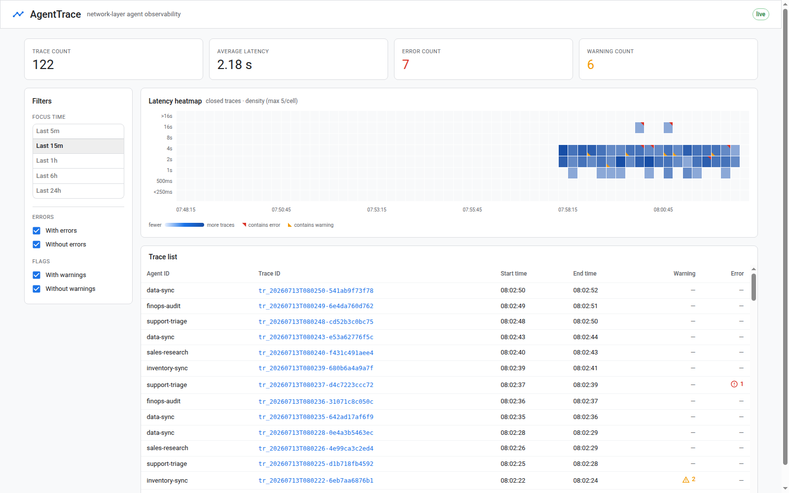
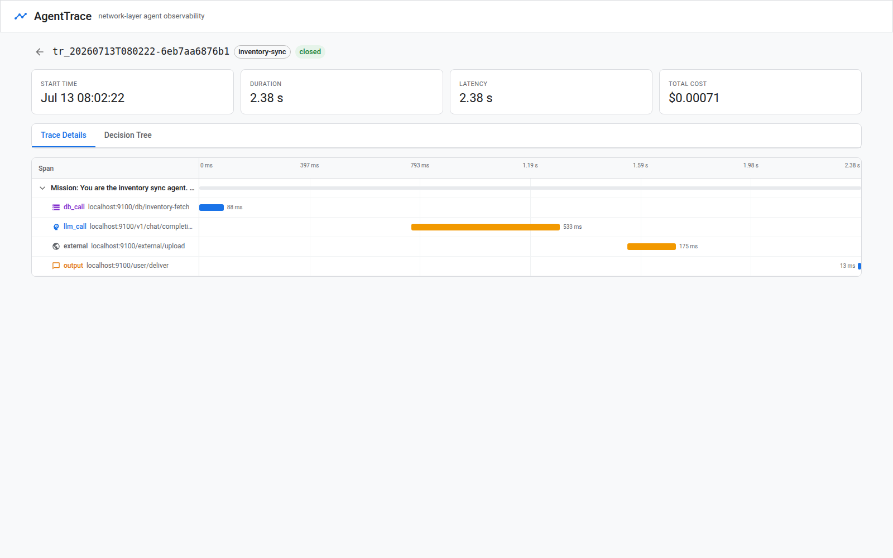
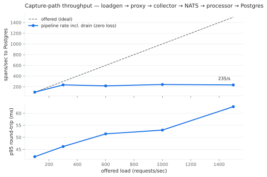
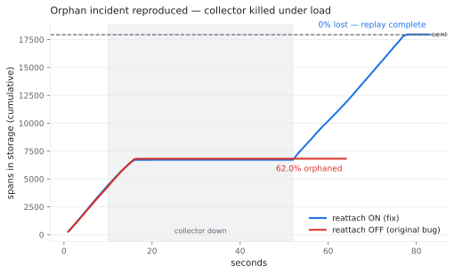

# AgentTrace

**Network-layer observability for AI agents. Zero agent code changes.**

AgentTrace watches what AI agents actually do — every LLM call, tool call,
database query, and outbound request — by capturing traffic at the network
layer. No SDK, no instrumentation, no redeploys. The security team deploys
one proxy on infrastructure they own and sees every agent immediately.

> **An SDK belongs to the dev team; the proxy belongs to the security team.**

**▶ Watch the 2-minute demo:**

<a href="https://youtu.be/5Bd7ftzNTqw" target="_blank">
  
</a>

**Backend Architecture**

The entire backend design process of the production system this replicates is described in
**[How we built agent observability at 100K events/sec](https://dev.to/aishiteru/how-we-built-agent-observability-at-100k-eventssec-pa1)** —
that article describes the real production-level system.

Snapshots:



*Above: the TraceHeatmap page under live fleet traffic.*



*Above: one trace of the misbehaving agent — the amber bars are the model checker catching a prompt injection and the policy engine catching an uncatalogued destination.*

**To start it: run this open-source project fully on your device**

1. Download to your local machine

```
git clone https://github.com/JamesZengGit/agent-trace-demo.git
cd agent-trace-demo
```

2. Set up

```
make up      # docker compose up → live dashboard on :3000 in under a minute
```

3. Optional evidence runs

```
make bench   # measured capture-path throughput (results in docs/bench/)
make chaos   # reproduce the 87%-orphan production incident + the fix
```

---

## What this repository is

I worked on this system in production; this is my solo re-engineering of it
as a public showcase. The original is described in
[How we built agent observability at 100K events/sec](https://dev.to/aishiteru/how-we-built-agent-observability-at-100k-eventssec-pa1).
The architecture, data model, and design decisions here are faithful to that
system; a few clearly-labeled improvements reflect what I would change today.
Where the replica deliberately simplifies, the label says so — every
simplification is listed in [Replica notes](#replica-notes-what-is-faithful-what-is-labeled).

## Why network-layer capture instead of OpenTelemetry

The buyers of the original system were security managers, and the design
follows from their threat model, not from tracing convention:

1. **Ownership.** SDK-based observability requires each application team to
   install a vendor library, configure it, and redeploy — per service, per
   language. Security teams don't own that code and can't force the schedule.
   A proxy is one deployment on infrastructure the security team controls,
   covering every agent regardless of language or framework.
2. **Tamper-resistance.** In-code instrumentation can be disabled, sampled,
   or made to lie from inside the agent. The proxy records what actually
   crossed the wire. Malicious or compromised agents don't get a vote —
   and unsanctioned "shadow agents" that never installed anyone's SDK are
   captured the same as sanctioned ones.

The deployment is fully offline and self-hosted: no data leaves the customer
environment. The proxy is not a vendor reading your prompts — it is the
security team's own control point, protecting their environment *from* the
agents. Both properties were design inputs from day one.

For teams already emitting OpenTelemetry, an [OTLP ingest adapter](#opentelemetry-adapter)
is provided as an optional on-ramp — never a requirement.

## Architecture

```
 agent fleet ──HTTP_PROXY──▶ capture proxy ──WS + acks──▶ collector
 (unmodified)                │ header injection            │ validate
                             │ policy check                ▼
                             │ body + timing        NATS JetStream   (⇄ swappable:
                             ▼                             │          GCP Pub/Sub)
                        mock LLM / tools / db              ▼
                                                      processor
                                                      │ trace assembly (timestamp)
                                                      │ error labeling
                                                      │ model checker → warnings
                                                      │ redaction hook
                                                      ▼
                                                  PostgreSQL (2 tables)
                                                      ▲
                                       api ───────────┘
                                       │ HTTP: closed traces
                                       │ WS: live edge
                                       ▼
                                  dashboard (Next.js)
```

Four pipeline components, faithful to the original:

| Component | What it does |
|---|---|
| **Capture proxy** (`cmd/proxy`) | Forward HTTP proxy the agents' egress flows through (standard `HTTP_PROXY` env — the agents are ordinary HTTP clients). Injects trace-context headers, evaluates the policy engine, captures prompts/responses/timing, ships spans to the collector over a WebSocket with sequence-numbered acks and a resend buffer. |
| **Collector** (`cmd/collector`) | Holds live proxy connections, validates spans, publishes to the transport. Acks only after the transport accepted the span — that ack contract is what makes reattachment safe. |
| **Transport** (`internal/transport`) | Pub/Sub-shaped interface. NATS JetStream locally (at-least-once, redelivery, parked messages); GCP Pub/Sub in production. The abandoned in-memory iteration is kept as a failing-under-burst test exhibit. |
| **Processor** (`cmd/processor`) | Assembles spans into trace missions by timestamp (idle-gap + terminal-span rules), labels errors, runs the model checker, applies the redaction hook, computes cost from captured usage, writes both tables, publishes the live edge. |

Plus the serving layer: **api** (HTTP queries + live WebSocket + OTLP inlet)
and the **dashboard** (TraceHeatmap macro view, TraceDetail micro view).

### Data model: spans and trace missions

Spans are the classic tracing unit — one network call, with type-dependent
attributes (client IP, destination, status, prompts, model response, token
usage). The **trace mission** is the organizing unit above them: the
initiating agent, its purpose, and the full span tree. Spans are leaves and
branches; the mission is the trunk. Agent workflows aren't flat call chains,
and this two-level model — not per-service flat traces — is what makes the
heatmap and the decision tree possible.

Correlation is by timestamp: agents are not instrumented, so a mission is an
agent's burst of activity. A span opens a trace; activity keeps it open; a
terminal output span or an idle gap closes it. Traces between agents are not
correlated (each agent's outbound calls are its own trace).

### Storage: two tables, designed for access patterns

```sql
trace_summary  -- composite PK (trace_id, agent_id): dashboard + heatmap reads
trace_detail   -- EAV rows (detail_name, detail_value): drilldowns, no-migration extensibility
```

The original system started with JSONB and abandoned it: nested-field queries
were slow and storage costs scaled faster than servers could be provisioned.
The lesson that survived: **design for access patterns, not data shape.**
Agents represent an activity context, not a queryable unit — so the agent
rides in the summary key instead of owning a table.

### Detection: errors and warnings

The trace layer labels spans with exactly two signals — deliberately simple,
because enforcement belongs to the wider governance platform this slice came
from:

- **Error** (assigned from observed traffic): HTTP 4xx/5xx; no answer
  (timeout, refused, dropped mid-response); or 200-but-the-body-says-failure
  (refusal, overload message, cut-off response). Rate limits, slow responses,
  and retries are *not* errors.
- **Warning**, from two sources: the **model checker** (scans captured LLM
  messages for prompt injection and data leakage) and the **policy engine**
  (per-agent destination restrictions; violations warn rather than block).

Both stand-ins are intentionally minimal — a pattern list and a YAML file —
because in the real platform they are separate systems. They are labeled as
stand-ins in the code.

**The demo climax:** the synthetic fleet contains one misbehaving agent
(`inventory-sync`). Every fourth mission it ingests a poisoned record
carrying a prompt injection, obeys it, and posts data to an uncatalogued
external endpoint. The model checker flags the injection, the policy engine
flags the destination, and both warnings surface on the dashboard in
real time — detection is the product's money shot.

## The dashboard

Two real-time pages (hybrid model: HTTP loads closed traces per window;
a WebSocket streams the live edge — running traces and traces closing now).

**TraceHeatmap (macro).** All traces in a focus window. X = time,
Y = latency, cell shade = trace density; red mark = an error trace is in that
bucket, amber = a warning. Metrics bar (count / avg latency / errors), filter
checkboxes (errors, flags), focus-time control. Clicking a cell draws a
selection box and filters the trace table to that bucket; clicking a row
opens the trace.

**TraceDetail (micro, "trace anatomy").** Metrics header (start, duration,
latency, cost computed from captured usage logs). Tab 1: collapsible span
tree aligned to a Jaeger-style waterfall; clicking a span opens a sheet with
Span Details / Output (the captured prompts and responses) / Reasoning — the
reasons behind any warning plus infrastructure detail. Tab 2: the decision
tree — mission → behavior → sub-behavior → span leaves, with error/warning
marks propagated up the branches. Behavior nodes come from a deterministic
labeler stand-in (production used a small model).

## Evidence, not claims

### `make bench` — measured capture-path throughput

Loadgen drives real HTTP through the full path (proxy → collector → NATS →
processor → Postgres) at increasing offered rates, then compares client-sent
counts against rows that actually reached storage — waiting for the pipeline
to drain, because with an at-least-once transport a backlog is latency, not
loss.

Measured 2026-07-13 on one 2-vCPU / 8 GB machine running all seven services
plus PostgreSQL and NATS (i.e., everything contending for the same two cores):

| offered req/s | client achieved | proxy p95 | pipeline → storage (incl. drain) | drain after load | spans lost |
|---:|---:|---:|---:|---:|---:|
| 100  | 99.8/s  | 42 ms | 99.8/s | 0 s  | **0** |
| 300  | 295/s   | 46 ms | 236/s  | 5 s  | **0** |
| 600  | 553/s   | 51 ms | 218/s  | 31 s | **0** |
| 1000 | 799/s   | 53 ms | 243/s  | 46 s | **0** |
| 1500 | 972/s   | 63 ms | 235/s  | 63 s | **0** |



Reading the numbers honestly: the **capture side** (proxy + collector +
JetStream) absorbed everything the client could push — ~970 req/s with a
63 ms p95 through-proxy round trip. The **processing side** (trace assembly +
enrichment + EAV writes) sustains ~235 spans/s on this hardware, so beyond
that the durable transport absorbs the difference as backlog and drains it
after the burst — with zero spans lost at every tier. (At high rates storage
actually exceeds client-confirmed sends: the proxy also captures requests
the client gave up waiting for — capture sees more than callers do.)

Two real bugs were found by this benchmark's accounting and are fixed with
regression tests: a sequence-assignment race in the proxy's resend buffer
that silently dropped ~0.1% of spans under 64-way concurrency
(`cmd/proxy/shipper_test.go`), and a dedup-before-persist ordering in the
processor that could turn a storage failure into silent loss. Reproduce with
`make bench`.

### `make chaos` — the 87% orphan incident, reproduced

The production war story: ~87% of trace records orphaned because agents held
connections to a specific collector pod:port; routine pod restarts reassigned
ports and stranded everything in flight. The fix was reattachment — detect the
dead connection and replay unacknowledged records.

`make chaos` kills the collector under steady load twice: once with
reattachment off (the original bug) and once with it on (the fix), and graphs
spans-reaching-storage over time.

Measured 2026-07-13 — 300 req/s for 60 s, collector dead from t=10s to t=52s:

| mode | spans sent | reached storage | orphaned |
|---|---:|---:|---:|
| reattach OFF (original bug) | 17,950 | 6,819 | **62.0%** |
| reattach ON (the fix) | 17,936 | 17,936+ | **0%** — full replay after reconnect |



The detail that made the production incident nasty: with reattachment off,
the loss is **silent**. The load generator saw every request succeed — the
proxy kept proxying perfectly while its capture pipe was dead. The
observability layer is the last thing anyone monitors, which is why every
component here exposes real counters (`accepted`, `rejected`, `stranded`)
on `/healthz` instead of a bare 200.

Details and the full incident narrative: [docs/chaos.md](docs/chaos.md).

## Labeled improvements (not in the original)

- **Redaction hook** (`internal/redact`) — masks secrets and PII after
  detection but before storage, so captured payloads never land raw on disk.
- **OpenTelemetry adapter** (`POST /otel/v1/traces`) — converts OTLP/HTTP
  JSON (honoring GenAI semantic conventions) into native spans. An optional
  inlet for teams already emitting OTel; the zero-code-change native path
  stays the headline.

## Replica notes: what is faithful, what is labeled

| Faithful to the original | Replica simplification (labeled) |
|---|---|
| 4-component pipeline, span + mission model, timestamp correlation, idle/terminal trace lifecycle | Proxy is Go, not Rust + Envoy; plain HTTP instead of TLS interception (same capture mechanism, less plumbing) |
| Two-table storage (summary composite PK + EAV detail), JSONB abandonment rationale | Mock LLM/tools/db backend — deterministic, offline, free to benchmark. The capture is real; only the destination is fake |
| WebSocket ingest with ack/reattach semantics; the orphan incident and its fix | Model checker + behavior labeler are deterministic stand-ins (production used model-based systems) |
| At-least-once transport with dedup at the processor | NATS JetStream stands in for GCP Pub/Sub behind the same interface |
| Error/warning taxonomy | Agent identity from a header (production attributed workloads at the network layer) |

Honest scale note: the article's 100K events/sec was a production fleet on
production hardware. The `make bench` numbers here are one machine running
all seven services plus the database — the point is that the numbers are
*measured and reproducible*, not projected. The known cost ceiling of the
EAV detail table at high scale is real (~3.6 KB per span at demo pace); a
built-in retention sweep ages out traces older than `AT_RETENTION` (default
24 h, `0` disables) so the table stops growing after day one. At production
scale I'd tier aged detail rows into columnar/object storage instead of
deleting, and keep Postgres for the summary path.

## Run it

```bash
make up        # full stack in Docker; dashboard on http://localhost:3000
make down      # tear down

# native (no Docker): local Postgres 16 + downloaded nats-server
./scripts/dev.sh start && (cd dashboard && npm run dev)
```

Ports used: 3000 (dashboard), 7000 (api), 7100 (collector), 7200 (processor),
8080 (proxy), 9100 (mocksvc), 4222 (NATS), 5432 (Postgres). `make up` stops a
running native dev stack automatically; a host PostgreSQL already listening on
5432 must be stopped by hand (`sudo systemctl stop postgresql`) or the
Postgres container's port mapping removed from `docker-compose.yml`.

The fleet starts automatically — five agents with scripted missions
(support triage, sales research, finops audit, data sync, inventory sync),
deterministic failure injection, and the misbehaving-agent scenario every
fourth inventory mission. `FLEET_SPEED=2 make up` doubles the pace for demos.

### OpenTelemetry adapter

```bash
./docs/examples/otlp-send.sh   # posts docs/examples/otlp-sample.json with fresh timestamps
```
The sample uses OpenTelemetry GenAI semantic conventions (`gen_ai.*`); the
agent named by `service.name` shows up in the dashboard like any proxied one.

## Repository map

```
cmd/proxy        capture proxy (forward proxy, header injection, policy, WS shipper)
cmd/collector    ingest tier (WS, validation, ack-after-publish)
cmd/processor    trace assembly, labeling, checker, redaction, storage
cmd/api          dashboard backend (HTTP + live WS) and OTLP inlet
cmd/mocksvc      deterministic LLM / tools / db / external endpoints
cmd/fleet        synthetic agent fleet incl. the misbehaving agent
cmd/loadgen      benchmark load driver
internal/…       model, transport, policy, checker, redact, behavior, store, otel
dashboard/       Next.js + TypeScript + MUI dashboard
scripts/         dev runner, bench, chaos
docs/            contract, chaos writeup, bench results
```
